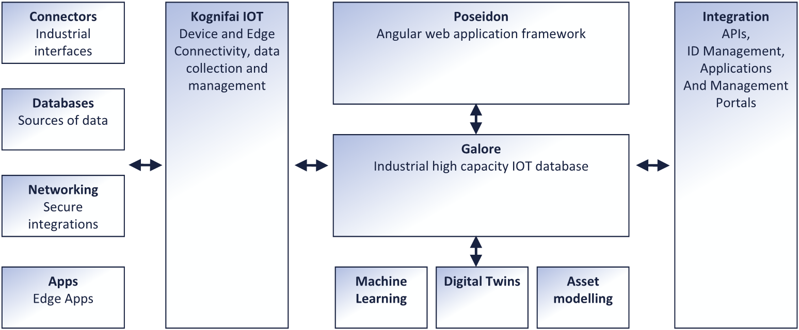
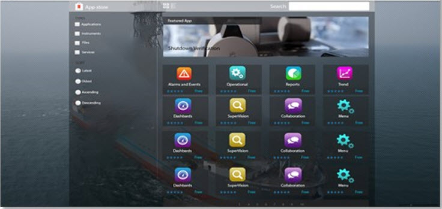
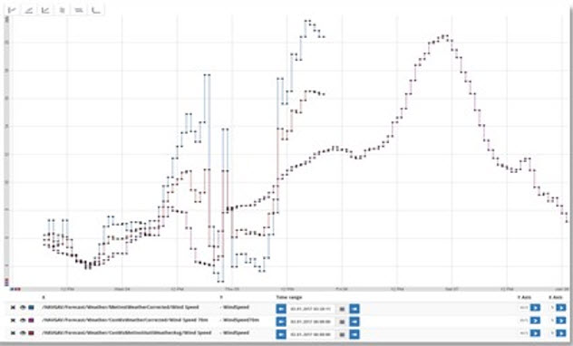
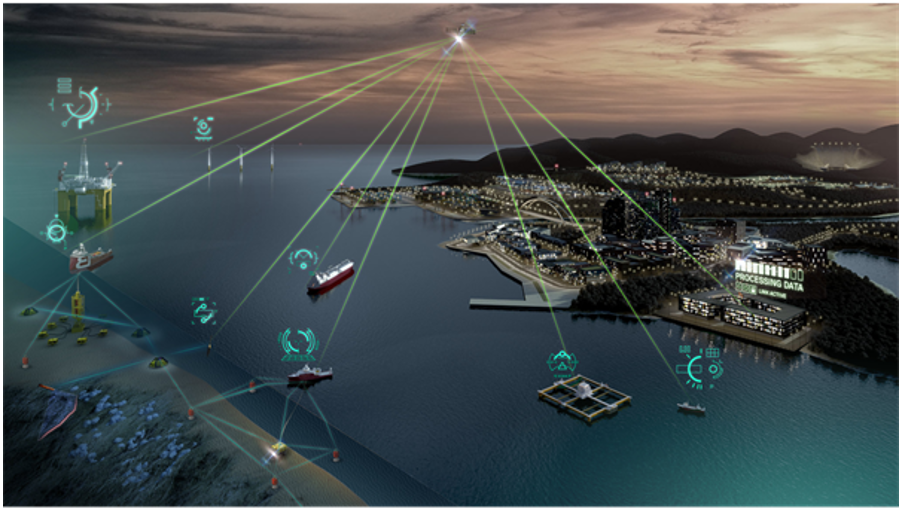
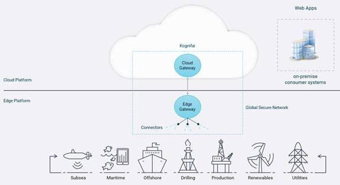

# About Kognifai                    

Welcome to the Kognifai Software Developer Kit! 

Kognifai is an industrial platform for accessing data, applying advanced analytics, running applications and accelerating digitalization initiatives in your industrial world. Kognifai is available both as an Edge on-premise installation and as a cloud service, offering secure connectivity and application services to your global assets.

 
The Kognifai ecosystem consists of an IoT Platform, a sensor database, analytic services, web application framework, network infrastructure, identity management, container and hosting services, machine learning platform, APIs, storage and self-service management portals.

In this SDK you will find documentation and examples on how to get started developing Kognifai App, Services and Connectors.

## Poseidon Next – Framework   

Poseidon is the Kognifai web application framework, built on Angular, by using the Kognifai Design System. It provides a fast way of developing and deploying new applications to both Kognifai Edge and Kognifai Cloud installation scenarios.

The framework takes responsibility for a range of basic features and is built in a modular way which opens up for different adaption levels.

 
* Identity Management – Embedded ThinkTecture Identity Server for authentication integration to a range of ID
*	Responsive Web Design – Support for all screen sizes
*	Design System – The framework is built on the Kognifai Design System
*	Edge and Cloud support - 

In this SDK you will find documentation on how to develop your own Poseidon applications, starting with the Poseidon Developer Edition available from https://npmjs.org and the sample application is also provided.

#### Related Topics   
-  [Poseidon Next – Framework](https://github.com/kognifai/PoseidonNext-Framework/blob/master/README.md) 
    - [Developers Getting Started page](https://github.com/kognifai/PoseidonNext-Framework/blob/master/Developers-Getting-Started.md)
    - [Services](https://github.com/kognifai/PoseidonNext-Framework/blob/master/Services.md)
    - [Widgets](https://github.com/kognifai/PoseidonNext-Framework/blob/master/SDK-documentation/Widgets.md)
   
 ## Galore   
 
Galore is the Kognifai time series and streaming database that is available as both an on-premise installable database and a Kognifai cloud service. The database is highly scalable and can be installed on everything from a small edge PC to a large cluster, supporting the smallest edge analytic scenarios as well as fleet wide global data collection and analytic scenarios.

This industrial quality database supports storage, analytics and distribution of most sensor like streaming data types:

*	Time series data – Single values, vectors or matrixes
*	Alarm & Event data – Indexed, searchable and related text values
*	Dataset – Larger dataset from high frequency analytic sensors and subsystems
*	Asset Structures – Mapping of physical industrial plants into structures, supporting templates and advanced graphs

 

The Galore database is built upon the concept of streams where all data is queryable either through the built-in advanced Timeseries Query Language (TQL) or through APIs.

In this SDK you will find detailed information on how to access and start using Galore, how to get started using the TQL language and how to use the APIs.

#### Related Topics
 -  [Galore](https://github.com/kognifai/Galore/blob/master/README.md)
      - [Galore Asset Model](https://github.com/kognifai/Galore/blob/master/SDK-documentation/TQL.md)
      - [Streams](https://github.com/kognifai/Galore/blob/master/SDK-documentation/streams.md)
      - [TQL Syntax](https://github.com/kognifai/Galore/blob/master/SDK-documentation/TQL%20Syntax.md)
      - [Node Selector](https://github.com/kognifai/Galore/blob/master/SDK-documentation/Node%20Selector.md) 
      - [Pipeline Operations](https://github.com/kognifai/Galore/blob/master/SDK-documentation/Pipeline%20Operations.md)
      - [Case Study](https://github.com/kognifai/Galore/blob/master/SDK-documentation/casestudy.md)

## Kognifai IoT    
The Kognifai IoT Platform is an industrial solution for securely connecting, managing and integrating remote devices and systems. Targeting everything from embedded sensors to energy production facilities, the platform is capable of scaling to thousands of globally distributed on and offshore installations.

Kognifai provides self-service portals for roll out and management of customer solutions, as well as a wide range of industrial connectors ensuring safe and reliable connectivity with data sources on the edge. Common connectors available on Kognifai are OPC UA, OPC DA / HDA, ModBus among others.

This SDK provides you  samples and documentation on how to build your own custom connector to integrate with a system that does not support these standard industrial interfaces.

 

The Connectors feed the Kognifai Edge Gateway which is responsible for data buffering in the case of connectivity loss, for compression, for secure authentication and for transport encryption to the Kognifai cloud endpoints:

-	Secure and reliable data transfer from Edge to cloud using AMQP, MQTT or HTTPS over TLS
-	Authentication towards Kognifai cloud services using certificates or shared secrets
- Data buffering to support disk offline scenarios
-	Reliable data transfer over unreliable communication channels
-	Logging, health and security data reporting

#### Related Topics

 -  [Kognifai IoT](https://github.com/kognifai/IoT)
      - [Connector SDK](https://github.com/kognifai/IoT/blob/master/SDK%20Documentation/Kognifai%20Connector%20SDK%20Overview.md)
      - [IoT Platform Architecture overview](https://github.com/kognifai/IoT/blob/master/IoT%20Documentation/Overview%20-%20IoT%20Platform%20Architecture%20Overview.md)
      - [Edge deployment models](https://github.com/kognifai/IoT/blob/master/IoT%20Documentation/Overview%20-%20Edge%20Deployment%20Models.md) 
     - [Edge connectors and endpoints overview](https://github.com/kognifai/IoT/blob/master/IoT%20Documentation/Overview%20%20Connectors%20and%20Endpoints%20.md)
     - [Sensor Configuration overview](https://github.com/kognifai/IoT/blob/master/IoT%20Documentation/Overview%20-%20Sensor%20Configuration%20Overview.md)
     - [IoT platform security](https://github.com/kognifai/IoT/blob/master/IoT%20Documentation/Overview%20-%20Security.md)
     - [Edge gateway components](https://github.com/kognifai/IoT/blob/master/IoT%20Documentation/Edge%20Gateway%20Components.md)
     - [Register a new device](https://github.com/kognifai/IoT/blob/master/IoT%20Documentation/Deploy-%20register%20a%20new%20edge%20device.md)
     - [Support for low bandwidht scenarios](https://github.com/kognifai/IoT/blob/master/IoT%20Documentation/Support%20for%20low%20bandwidth%20scenarios.md)
 
### Infrastructure   

The Kognifai platform provides infrastructure for both Edge and Cloud. The secure connectivity is needed among sites, edges, cloud and other platforms.

#### Related Topics
- [Infrastructure - GSN Overview](https://github.com/kognifai/Infrastructure/blob/master/README.md#infrastructure_documentation)
    * [Life Cycle Management](https://github.com/kognifai/Infrastructure/blob/master/SDK-documentation/GSN%20Overview.md)
    - [High-level Design](https://github.com/kognifai/Infrastructure/blob/master/SDK-documentation/High-level%20Design.md).
    - [Securing Internet of Things](https://github.com/kognifai/Infrastructure/blob/master/SDK-documentation/Securing%20Internet%20of%20Things.md).
     

